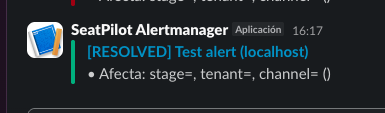

# 2025-10-26 · Observability Hardening (TLS + Slack + SLO)

## Evidencia requerida

- [x] Slack — alerta **FIRING** (`#seatpilot-alerts`)
- [x] Slack — alerta **RESOLVED**
- [x] Prometheus — pestaña _Rules_ mostrando `DoorToSeatP95High`
- [x] Cabeceras TLS/seguridad (`curl -Ik https://ops.localhost/healthz`)

## Capturas

1. **Slack FIRING**  
   

2. **Slack RESOLVED**  
   

3. **Prometheus — Rules (`DoorToSeatP95High`)**  
   

4. **Headers TLS/Seguridad**
   strict-transport-security: max-age=63072000; includeSubDomains; preload
   x-content-type-options: nosniff
   x-frame-options: DENY
   referrer-policy: same-origin
   permissions-policy: geolocation=()
   content-security-policy: default-src 'self'; connect-src 'self'; img-src 'self' data:; script-src 'self'; style-src 'self' 'unsafe-inline'; frame-ancestors 'none'

## Notas

- Ajusta `connect-src` / `style-src` en `ops/nginx/seatpilot.conf` si el dominio final requiere orígenes adicionales.
- Si la alerta no llega a Slack, revisa `docker logs seatpilot-alertmanager-1` y valida el webhook.
